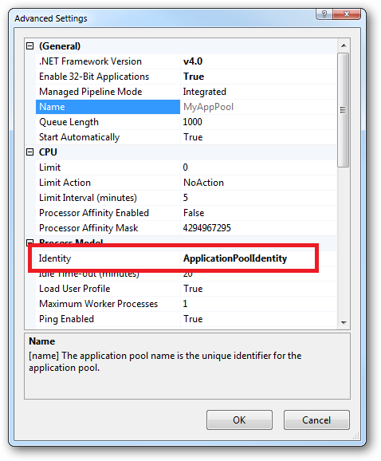

# Managing Security of Website

TODO: tidy this up :)

In practice the preferred approach to securing a website (if the site gets its own application pool - which is the default for a new site in IIS7's MMC) is to run under Application Pool Identity. This means setting the site's Identity in its Application Pool's Advanced Settings to Application Pool Identity

In the website you should then configure the Authentication feature

Right click and edit the Anonymous Authentication entry

Ensure that Application pool identity is selected

When you come to apply file and folder permissions you grant the Application Pool identity whatever rights are required. For example if you are granting the application pool identity for the ASP.NET v4.0 pool permissions, then you can either do this via Explorer
If pool is named RipplePool then user will be IIS AppPoolRipplePool

Click the Check Names button

Web Deploy httpwww.troyhunt.com201011you-deploying-it-wrong-teamcity_24.html

Visual Studio Settings
Service URL httpwww.beyondmarkets.commsdeployagentservice

Windows Server Backup Strategies
httpblog.softwaresynergy.comblogp=975
httpblog.softwaresynergy.comblogp=984
httpblog.softwaresynergy.comblogp=1008

Management via PowerShell
Server Manager
Add-WindowsFeature [-Name] string[] [-IncludeAllSubFeature] [-logPath string] [-WhatIf] [-Restart] [-Concurrent] [CommonParameters] - this one adds features
Get-WindowsFeature [[-Name] string[]] [-logPath string] [CommonParameters] - this one lists features
Remove-WindowsFeature [-Name] string[] [-logPath string] [-WhatIf] [-Restart] [-Concurrent] [CommonParameters] - this one removes features

Server Preparation via PowerShell
Add-WindowsFeature Web-Server
Add-WindowsFeature Web-Asp-Net45
Add-WindowsFeature Web-Mgmt-Service
Enable remote management Set-ItemProperty -Path HKLMSOFTWAREMicrosoftWebManagementServer -Name EnableRemoteManagement -Value 1
Restart Web-Mgmt-Service for changes to take effect Net Stop WMSVC and Net Start WMSVC
Allow Web Management Service incoming connections in firewall netsh advfirewall firewall add rule name=”Allow Web Management” dir=in action=allow service=”WMSVC”
Install IIS Management Console and then IIS Manager for Remote Administration on computer from which the server will be managed

Also add firewall exception for SQL server remote management netsh advfirewall firewall add rule name=”Allow SQL Server Expresss” dir=in action=allow service=”MSSQL$SQLEXPRESS”
